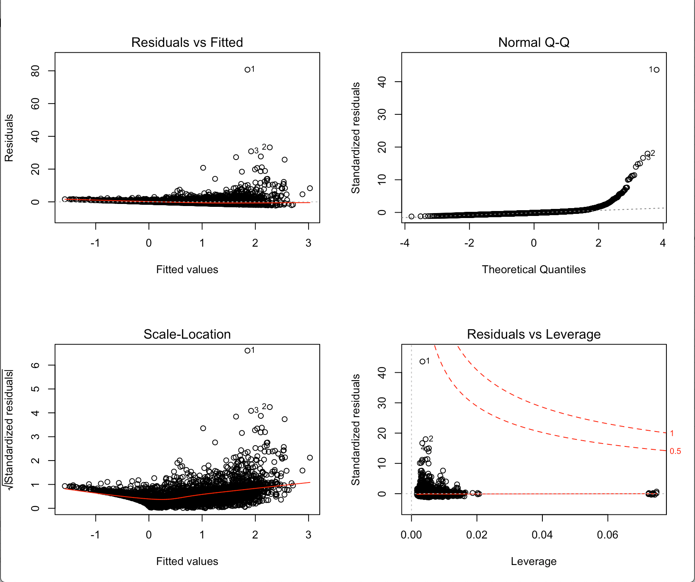
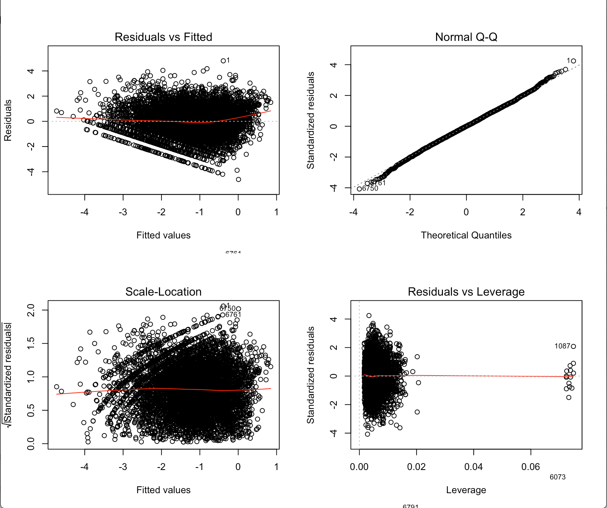

```{r setup, include=FALSE}
knitr::opts_chunk$set(echo = TRUE)
```

## Introduction
(Andrew-Son Le)  

For our dataset, we chose to work with “Video Game Sales with Ratings” (https://www.kaggle.com/rush4ratio/video-game-sales-with-ratings) from Kaggle. We chose this source because we all grew up playing video games and were interested in viewing them from a statistical standpoint. The data set has 16179 (~16000) observations, each consisting of 16 main variables: 

Name, Platform, Year_of_Release, Genre, Publisher, NA_Sales, EU_Sales, JP_Sales, Other_Sales, Global_Sales, Critic_Score, Critic_Count, User_Score, User_Count, Developer, and Rating.

Among these, Platform, Genre, and Rating are further broken up into sub-levels because we used as.factor():

Platform: 2600, 3DO, 3DS, DC, DS, GB, GBA, GC, GEN, GG, N64, NES, NG, PC, PCFX,  PS, PS2, PS3, PS4, PSP, PSV, SAT, SCD, SNES, TG16, Wii, WiiU, WS,  X360, XB, XOne

Genre: Action,     Adventure, Fighting, Misc, Platform, Puzzle, Racing, Role-Playing, Shooter Simulation, Sports, Strategy

Rating:  AO, E, E10+, EC, K-A, M, RP, T

Before working with the data, we had to clean the dataset using na.omit due to the presence of observations that were missing either Critic_Score, Critic_Count, User_Score, User_Count, and/or Rating. After this, we were left with 6819 (~7000) observations.

(Jay Nguyen, Andrew-Son Le)  

We chose Global_Sales as our response variable because it is both the most important and the most variable aspect of a video game. Originally, we wanted to pose two questions about the data: 

* What aspect of a video game is the most telling predictor of its global sales (Global_Sales)? 
* What aspect of a video game is the best predictor of  its success (where success would be a dummy variable whose value would be “Yes” if Global_Sales > 1 or no otherwise)? 

However, as per our instructor’s advice, we chose to focus on just one main overall question. As a result, we dropped our question regarding success. 

Because we are more interested in the factors that affect Global_Sales rather than the actual value of Global_Sales itself, our question is one of inference rather than prediction.

## Linear Model
(Alonso Munoz, Andrew-Son Le)  

We used a regression model because we wanted to find which of the predictors had a relationship with Global_Sales and how significant that relationship was. Additionally, since the response variable is quantitative, we had to use linear rather than logistic regression. Therefore, we will be using a multiple linear regression model. 

A multiple regression model follows $Y = \beta_0 + \beta_1*X_1 + \beta_2*X_2 + ... + \beta_p*X_p + \varepsilon$ where $X_p$ represents our predictors and $\beta_p$ represents the coefficients related to the predictors in the linear model. The goal of the multiple linear regression model is to estimate each $\beta_p$ coefficient. This will then help us understand each variable’s relationship with the response variable, which in our case is the Global_Sales. 

The advantages of the linear regression model are that it is simple and easy to interpret. 
The disadvantages of the linear regression model are that it can be overfitted, it is sensitive to outliers, and it assumes linearity between the response and the predictors.

(Andrew-Son Le, Alonso Munoz)  

The equation of the Linear Regression Model is:

Global_Sales = $\beta_0$ + Platform * $\beta_1$ + Year_of_Release * $\beta_2$ + Genre * $\beta_3$ + Critic_Score * $\beta4$ + User_Score * $\beta_5$ + Rating * $\beta_6$ + $\varepsilon$. 

For variables Platform, Genre, and Rating, the coefficients depend on the various sublevels. The coefficient for each sublevel can be found below in the summary of our linear regression model.

{width=50%}
{width=50%}

On the left is the plots using Global_Sales. On the right is the plots using log(Global_Sales)

(Jay Nguyen, Alonso Munoz, Andrew-Son Le)  

Since the variable Name is different for each observation, we removed it from the models because we could not derive any meaningful interpretations from it. Before fitting the linear regression model, we removed the regional sale predictors, such as NA_Sales and EU_Sales, due to already having a Global_Sales variable. Since Global_Sales is the sum of all regional sales, including the regional sales values would end up being redundant. 

We also removed the count predictors, Critic_Count and User_Count. The number of reviews Critics and Users gave is more of a reflection of Global_Sales than a predictor because as more copies of a game are sold, there will inevitably be a corresponding increase in the number of reviews. 

Originally, the Year_of_Release variable was a string which meant that we had to treat it as a categorical variable and use as.factor(). This caused some issues because there was a sublevel for each year over an interval of around 20 years. However, we were able to convert the values to integers using as.numeric() which made our linear regression model cleaner and made Year_of_Release easier to interpret.

Another consideration we had to account for was that our data was not normally distributed. To remedy this, we chose to log Global_Sales which normalized the data. 

We had to remove observations that contained certain sublevels from Ratings as some of those observations would end up in the testing set and not the training set because they were too few in number. If we did not remove them, the model would encounter data that was not accounted for in the training set, causing errors to occur.

We also tried using the step function to remove any unnecessary variables, but none were removed suggesting that all of the variables were needed in the model.

```{r,message=FALSE,warning=FALSE,results='hide'}
library(randomForest) # Loading in libraries       (Alonso Munoz)
load("~/Documents/GitHub/Math4322-GP/Paper environment.RData")
```

```{r,message=FALSE,warning=FALSE,eval=FALSE}
seeds = floor(runif(10, min=0, max=9999999))

## Linear Model 10 times
linear_model_10_mse = rep(0,10)

for(i in 1:10){
  set.seed(seeds[i])
  train = sample(1:nrow(data_global),nrow(data_global)*.80)
  data_lm = lm(log(Global_Sales)~., data = data_global,subset = train)
  data_lm_yhat = predict.lm(data_lm, newdata = data_global[-train,])
  data_lm_test = data_global[-train,"Global_Sales"]
  linear_model_10_mse[i] = mean((log(data_lm_test$Global_Sales)-data_lm_yhat)^2)
}
```
```{r}
lm_full = lm(log(Global_Sales)~.,data = data_global)
summary(lm_full)
```

(Jay Nguyen, Andrew-Son Le)  

The overall p-value of the model is < 2.2e-16 which is lower than $\alpha$ at $\alpha$ = 0.05. This means that at least one of the predictors is useful in predicting the response.

We used the summary of our linear regression model to determine each variable’s effect on Global_Sales. In the model with the presence of the other predictors:  

* Platform(DC, GBA, GC, PC, PSV, Wii, XB), Genre(Adventure, Puzzle, Sports, Strategy), Critic_Score, User-Score, and Rating(E10+, T) were denoted as extremely significant ($***$).
* GenreRole-Playing and Platform(XOne, PSP) were considered very significant ($**$).
* Platform(PS3, PS4) and GenreRacing were labeled as significant ($*$).   

Of these, Critic_Score, User_Score and Platform_PC had by far the lowest p-values (< 2e-16) and so we expect that they are the most important predictors of a video game’s global sales.

Using log(Global_Sales), all plots (Residuals, Normal QQ, Standardized Residuals, and Extreme Values) appeared to follow the assumptions.

The R-squared value of the model is 0.3458, meaning that the model explains 34.58% of the variability of Global_Sales around the mean. The mean test MSE for the linear regression model was 1.305145.

## Random Forest Model
(Alonso Munoz, Andrew-Son Le)  

Random forests are similar to bagging but add a small tweak in order to further improve as a model. Random forests grow B large un-pruned trees, but only pick a random subset of m ~$\sqrt{p}$ predictors instead of using the full set of p predictors like bagging does. This tweak leads to decorrelating the bagged trees, which means there is a lower chance that the same variable dominates each bagged tree. This tweak essentially makes random forests better than bagging and single decision trees, which led us to choose it for this project.

The advantages of the random forest model are that it generally has a lower test error compared to other models, avoids overfitting as long as there are enough trees being grown, decorrelates the bagged trees, and stabilizes the variance of the estimate. 

The disadvantages of the random forest model are that it can be more computationally intensive compared to the other models like the decision tree as it is creating multiple trees, pruning them, and averaging out all the trees together. Additionally, as opposed to a more visual model such as the single decision tree, random forests can be harder to interpret.

(Andrew-Son Le, Alonso Munoz)  

The equation of the Random Forest Model is:

Global_Sales ~ Platform + Year_of_Release + Genre + Critic_Score + User_Score + Rating

(Jay Nguyen, Alonso Munoz, Andrew-Son Le)  

We once again removed the predictors Name, the regional sales variables, User_Count, and Critic_Count for the reasons specified above in the linear model and to keep the data consistent across both models. 

While fitting the Random Forest model, we ran into issues with performance. The predictors Publisher and Developer had too many unique values which caused the model to have trouble splitting based on the predictors and running in general. We decided to omit these predictors from both models, which resulted in faster computational times and a consistently working random forest model. 

```{r,message=FALSE,warning=FALSE,eval=FALSE}
## Random Forest 10 times (Alonso Munoz)
rf_model_10_mse = rep(0,10)

for(i in 1:10){
  set.seed(seeds[i])
  train = sample(1:nrow(data_global),nrow(data_global)*.80)
  data_randomforest = randomForest(log(Global_Sales)~., data = data_global,subset = train)
  data_randomforest_yhat = predict(data_randomforest, newdata = data_global[-train,])
  data_randomforest_test = data_global[-train,"Global_Sales"]
  rf_model_10_mse[i] = mean((log(data_randomforest_test$Global_Sales)-data_randomforest_yhat)^2)
}
```
```{r}
rf_full = randomForest(log(Global_Sales)~., data = data_global,importance = TRUE)
rf_full
varImpPlot(rf_full)
```

(Jay Nguyen, Andrew-Son Le)  

The variable importance plot (varImpPlot) shows that Critic_Score is the most important variable, followed by Platform. The predictors, in order from most important to least, are Critic_Score, Platform, Genre, Year_of_Release, Rating, and finally User_Score.

The % Var explained is 42.6, meaning that 42.6% of the variation is explained by the random forest model. The mean test MSE for the random forest model was 1.143965.

## Conclusion

(Alonso Munoz, Jay Nguyen)  

The linear regression model is more useful in seeing how the predictors affect Global_Sales. Using the given coefficient values from summary(), we can determine whether predictors benefit or negatively impact Global_Sales. From the summary we see that User_Score, Critic_Score, and PlatformPC are the most significant variables to Global_Sales. 

The random forest model is better for figuring out which variables are more important in determining the response variable. From the random forest’s varImpPlot, we learned that Critic_Score is by far the most important predictor with Platform being the only other predictor with notable significance. User_Score had the least importance which surprised us, especially considering how it was deemed extremely significant by the linear regression model.

Drawing from both of our models, we can conclude that Critic_Score is the most telling predictor of a video game’s global sales.

For additional information and code, please see https://github.com/alonsomunoz/Math4322-GP 
